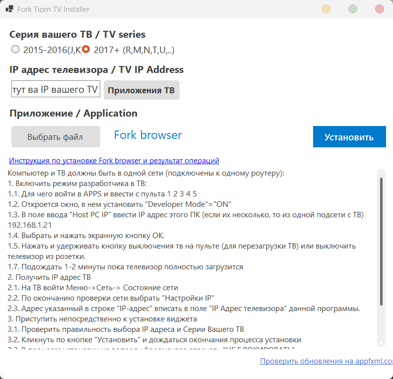

# Vseti для Samsung Tizen

**Vseti** — приложение для телевизоров Samsung с операционной системой Tizen.

## Скачать Vseti

Перейдите в раздел [**Releases**](https://github.com/KinoVestnik/Vseti-tizen/releases/latest) и скачайте последнюю версию приложения в формате `.wgt`.

## Установка

Установить файл `.wgt` на телевизор Samsung с OS Tizen можно с компьютера на Windows с помощью программы **Samsung Tizen ForkTizenInstall**.

ForkTizenInstall — готовый установщик виджетов, который позволяет загружать приложения с ПК непосредственно в память телевизора.

### Подготовка телевизора

Перед установкой необходимо включить на телевизоре **Developer Mode**:

1. Откройте раздел **APPS** на телевизоре.
2. Последовательно нажмите на пульте `1 2 3 4 5`.
3. В появившемся окне установите **Developer Mode** в положение **ON**.
4. В поле **Host PC IP** введите IP-адрес компьютера, с которого будет выполняться установка.
5. Нажмите **OK**.
6. Перезагрузите телевизор: удерживайте кнопку питания на пульте до повторного включения ТВ либо отключите телевизор от розетки.
7. После включения подождите 1–2 минуты, пока телевизор полностью загрузится.

IP-адрес компьютера можно узнать в Windows с помощью команды `ipconfig` — используйте значение **IPv4-адрес** активного сетевого подключения.

### Порядок установки

1. Скачайте последнюю версию **Vseti** в формате `.wgt` из раздела [Releases](https://github.com/KinoVestnik/Vseti-tizen/releases/latest).
2. Скачайте [**Samsung Tizen ForkTizenInstall**](https://appfxml.com/apps/ForkTizenInstall1.0.1_2.zip).
3. Распакуйте архив ForkTizenInstall на компьютере с Windows.
4. В распакованном архиве найдите папку `apps` и поместите в неё скачанный файл Vseti `.wgt`.
5. Подключите компьютер и телевизор Samsung к одной локальной сети. **Важно:** оба устройства должны находиться в одной сети.
6. Запустите файл `ForkTizenInstaller.exe`.
7. Выберите серию телевизора:
   - **2015–2016** — серии `J` и `K`;
   - **2017+** — серии `M`, `N`, `R`, `T`, `U` и новее.
8. Введите IP-адрес телевизора.
9. Выберите приложение Vseti и нажмите **Установить**.
10. Дождитесь завершения установки.

### Как найти IP-адрес телевизора

На телевизоре Samsung откройте:

**Настройки → Общее → Сеть → Состояние сети → Настройки IP**

Нужное значение указано в поле **IP-адрес**.

### ForkTizenInstall

- [Скачать ForkTizenInstall 1.0.1](https://appfxml.com/apps/ForkTizenInstall1.0.1_2.zip)
- [Открыть страницу автора программы](https://appfxml.com/?_from=forktizeninstall)

---

После установки Vseti появится в списке приложений телевизора Samsung.
